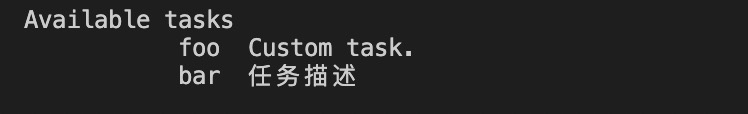
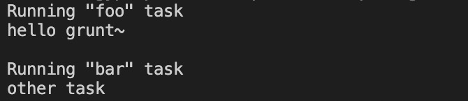
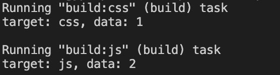
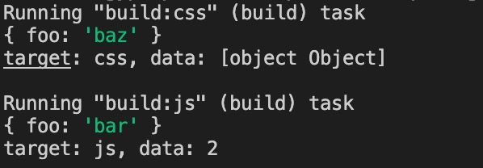

# Grunt

> [Grunt 中文网](https://www.gruntjs.net/)

## 基本使用

### 安装

```shell
$ yarn add grunt
```

在目录下添加 `gruntfule.js` 文件，该文件为 Grunt 的入口文件，用于定义一些需要 Grunt 自动执行的任务。

```js
// gruntfule.js

// Grunt 的入口文件
// 用于定义一些需要 Grunt 自动执行的任务
// 需要导出一个函数
// 此函数接受一个 grunt 的形参，内部提供一些创建任务时，可以用到的 API
module.exports = (grunt) => {
  // 使用 registerTask 方法，注册一个任务
  // 第一个参数为任务的名称，第二个参数为任务函数，即任务发生时，自动执行的函数
  grunt.registerTask('foo', () => {
    console.log('hello grunt~')
  })

  // 第二个参数如果为字符串，则该参数为该任务的说明，可通过 yarn grunt --help 查看任务说明
  grunt.registerTask('bar', '任务描述', () => {
    console.log('other task')
  })

  // 任务名为 default 时，可直接使用 yarn grunt 执行，不需指定任务名
  // 第二个参数为数组时，可作任务映射，依次执行各任务
  grunt.registerTask('default', ['foo', 'bar'])
  
  // 针对异步任务，首先，需调用 this.async() 获取一个回调函数 done，待异步任务完成后，调用 done 函数标识异步任务完成
  grunt.registerTask('async', function () {
    const done = this.async()
    setTimeout(() => {
      console.log('async end')
      done()
    }, 1000)
  })
}
```

### 执行

执行命令 `yarn grunt foo`（`foo` 为任务名称），即可运行相应的任务。

#### 第二个参数为字符串时，可通过 yarn grunt --help 查看任务说明



#### default 任务的用处

当 `default` 任务，第二个参数为数组时，我们可以在这个数组中指定一些任务，此时 `grunt` 运行时，将会依次执行各个任务。

执行 `yarn grunt`，可查看结果。



## 标识任务失败

在任务执行的过程中，可能存在失败的情况（如文件路径未找到等）。此时我们可标识该任务为失败。

- 同步任务，直接返回 false；
- 异步任务，获取 `this.async()` 的回调函数，在该回调函数中，传入 false。

```js
module.exports = (grunt) => {
  // 失败任务-同步，直接 return false 即可
  grunt.registerTask('bad', () => {
    return false
  })

  // 失败任务-异步，在 done 函数中，传入 false
  grunt.registerTask('bad-async', function () {
    const done = this.async()
    setTimeout(() => {
      console.log('async end')
      done(false)
    }, 1000)
  })
}
```

如果在失败的任务，处在一个队列中，任务的失败会影响，其余任务的执行。

可在执行命令中添加 `--force` 后缀，强制其它任务执行。

## 配置选项方法

我们可以通过 `initConfig` 方法，定义一些全局配置参数，该方法接受一个对象作为参数。

之后我们可以在任务中，通过 `config` 方法，获取这些参数。

```js
module.exports = (grunt) => {
  // 设置参数
  grunt.initConfig({
    path: './assets'
  })

  grunt.registerTask('foo', () => {
    // 获取参数
    console.log(grunt.config('path'))
  })
}
```

## 多目标任务

我们可以通过 `registerMultiTask` 注册多目标任务，接受的参数与 `registerTask` 相同。

```js
module.exports = (grunt) => {
  grunt.initConfig({
    build: {
      options: {
        foo: 'bar'
      },
      css: '1',
      js: '2'
    }
  })

  // 多目标模式，可以让任务根据配置形成多个子任务
  grunt.registerMultiTask('build', 'build task', function () {
    // 获取对应的目标名及值
    console.log(`target: ${this.target}, data: ${this.data}`)
  })
}
```

使用该任务时，需在 `initConfig` 方法中配置对应名称的目标。

运行命令 `yarn grunt build` 时，会对多个目标进行执行，如下图。



如果只想针对单个目标进行执行，可在 `yarn grunt build` 的基础上加上 `:目标名` 的方式，例如  `yarn grunt build:css ` 的方式。

在对应的任务函数中，我们可以通过 `this.target` 和 `this.data` 获取对应的目标名及值。

需要注意的是，在 `initConfig` 方法中，注册的每一个键，除了 `options` 外，都会作为一个目标。`options` 会作为任务的配置选项。这个时候，我们可以在任务函数中，通过 `this.options()` 方法获取配置。

如果目标的值也为一个对象，我们也可以通过添加 `options` 的方式，覆盖上面的配置项。

```js
module.exports = (grunt) => {
  grunt.initConfig({
    build: {
      options: {
        foo: 'bar'
      },
      css: {
        options: {
          foo: 'baz'
        }
      },
      js: '2'
    }
  })

  // 多目标模式，可以让任务根据配置形成多个子任务
  grunt.registerMultiTask('build', 'build task', function () {
    console.log(this.options())
    console.log(`target: ${this.target}, data: ${this.data}`)
  })
}
```

结果如下：



## 插件的使用

针对社区中提供的一些插件，我们可以更好的使用 Grunt。

Grunt 的插件，一般以 `grunt-contrib-**` 的方式命名，其中，** 为对应的任务名。

### 以 grunt-contrib-clean 为例

#### 安装

```shell
$ yarn add grunt-contrib-clean
```

```js
module.exports = (grunt) => {
  grunt.initConfig({
    clean: {
      // temp/a.txt 清除对应文件
      // temp/*.txt 清除对应后缀为 txt 的文件
      // temp/** 清除全部文件
      temp: 'temp/**'
    }
  })

  grunt.loadNpmTasks('grunt-contrib-clean')
}
```

在 `grunt-contrib-clean` 中，我们需在 `initConfig` 中配置对应的清除路径，执行 `yarn grunt clean`  即可清除对应路径下的命令。

## 实现常用的构建任务

### grunt-sass

编译 sass 文件成 css 文件。

#### 安装

```shell
$ yarn add grunt-sass sass --dev
```

#### 使用

```js
const sass = require('sass')

module.exports = (grunt) => {
  grunt.initConfig({
    sass: {
      options: {
        implementation: sass
      },
      main: {
        files: {
          // 目标路径: 源路径
          'dist/css/main.css': 'src/scss/main.scss'
        }
      }
    }
  })

  grunt.loadNpmTasks('grunt-sass')
}
```

使用命令 `yarn grunt sass`  即可进行文件的编译。

更多可参考：[grunt-sass  -  npm](https://www.npmjs.com/package/grunt-sass)

### load-grunt-tasks

优化 grunt 中，loadNpmTasks 的使用，自动加载所有的 grunt 插件中的任务。

#### 安装

```shell
$ yarn add load-grunt-tasks --dev
```

#### 使用

```js
const loadGruntTasks = require('load-grunt-tasks')
const sass = require('sass')

module.exports = (grunt) => {
  grunt.initConfig({
    sass: {
      options: {
        implementation: sass
      },
      main: {
        files: {
          // 目标路径: 源路径
          'dist/css/main.css': 'src/scss/main.scss'
        }
      }
    }
  })

  loadGruntTasks(grunt) // 自动加载所有的 grunt 插件中的任务
}
```

### grunt-babel

编译 JavaScript 到指定的版本。

#### 安装

```shell
$ yarn add grunt-babel @babel/core @babel/preset-env --dev
```

#### 使用

```js
const loadGruntTasks = require('load-grunt-tasks')
const sass = require('sass')

module.exports = (grunt) => {
  grunt.initConfig({
    sass: {
      options: {
        implementation: sass
      },
      main: {
        files: {
          // 目标路径: 源路径
          'dist/css/main.css': 'src/scss/main.scss'
        }
      }
    },
    babel: {
      options: {
        sourceMap: true,
        presets: ['@babel/preset-env']
      },
      main: {
        files: {
          // 目标路径: 源路径
          'dist/js/app.js': 'src/js/app.js'
        }
      }
    }
  })

  loadGruntTasks(grunt)
}
```

使用命令 `yarn grunt babel`  即可进行文件的编译。

更多可参考：[grunt-babel  -  npm](https://www.npmjs.com/package/grunt-babel)

### grunt-contrib-watch

文件发生变化后，自动编译。

#### 安装

```shell
$ yarn add grunt-contrib-watch --dev
```

#### 使用

```js
const loadGruntTasks = require('load-grunt-tasks')
const sass = require('sass')

module.exports = (grunt) => {
  grunt.initConfig({
    sass: {
      options: {
        implementation: sass
      },
      main: {
        files: {
          // 目标路径: 源路径
          'dist/css/main.css': 'src/scss/main.scss'
        }
      }
    },
    babel: {
      options: {
        sourceMap: true,
        presets: ['@babel/preset-env']
      },
      main: {
        files: {
          // 目标路径: 源路径
          'dist/js/app.js': 'src/js/app.js'
        }
      }
    },
    watch: {
      js: {
        // 需监听的文件
        files: ['src/js/*.js'],
        // 文件发生变化后，需执行的任务
        tasks: ['babel']
      },
      css: {
        // 需监听的文件
        files: ['src/scss/*.scss'],
        // 文件发生变化后，需执行的任务
        tasks: ['sass']
      }
    }
  })

  loadGruntTasks(grunt)
}
```

使用命令 `yarn grunt watch`  后，会对文件进行监听，发生变化后，进行编译。

### 最后

添加以下代码，达到执行命令 `yarn grunt` 依次执行以上命令。

```js
grunt.registerTask('default', ['sass', 'babel', 'watch'])
```

